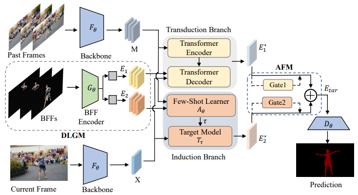

# VOS-LLB
The official repo for [AAAI'23] [Learning to Learn Better for Video Object Segmentation](https://arxiv.org/pdf/2212.02112.pdf).

<p align="center">
  
</p>

## Installation
### Clone this repository 
```bash
git clone https://github.com/ViTAE-Transformer/VOS-LLB.git
```

### Install dependencies
Please check the [detailed installation instructions](INSTALL.md).

## Model Zoo
The  weights could be downloaded in [here](https://drive.google.com/drive/folders/1Kkm1cOfgSySpSgHvzW7hgbdAjeb5iiwj?usp=share_link).
## Training
```bash
cd ltr
python run_training.py joint joint_stage1  # stage 1
python run_training.py joint joint_stage2  # stage 2
```
**Note:** Before training, you need to download and save the pretrained backbone weights in env_settings().pretrained_networks directory.

## Evaluation
```bash
cd pytracking
python run_tracker.py joint joint_davis --dataset_name dv2017_val        # DAVIS 2017 Val
python run_tracker.py joint joint_ytvos --dataset_name yt2018_valid_all  # YouTube-VOS 2018 Val
```
**Note:**  the trained weights should be moved to the directory set by "network_path" in "pytracking/evaluation/local.py". By default, it is set to pytracking/networks.


## Acknowledgement
This codebase borrows the code and structure from [official JOINT repository](https://github.com/maoyunyao/JOINT)
## Citation

```
@article{lan2022learning,
  title={Learning to Learn Better for Video Object Segmentation},
  author={Lan, Meng and Zhang, Jing and Zhang, Lefei and Tao, Dacheng},
  booktitle={Proceedings of the AAAI Conference on Artificial Intelligence},
  year={2023}
}
```